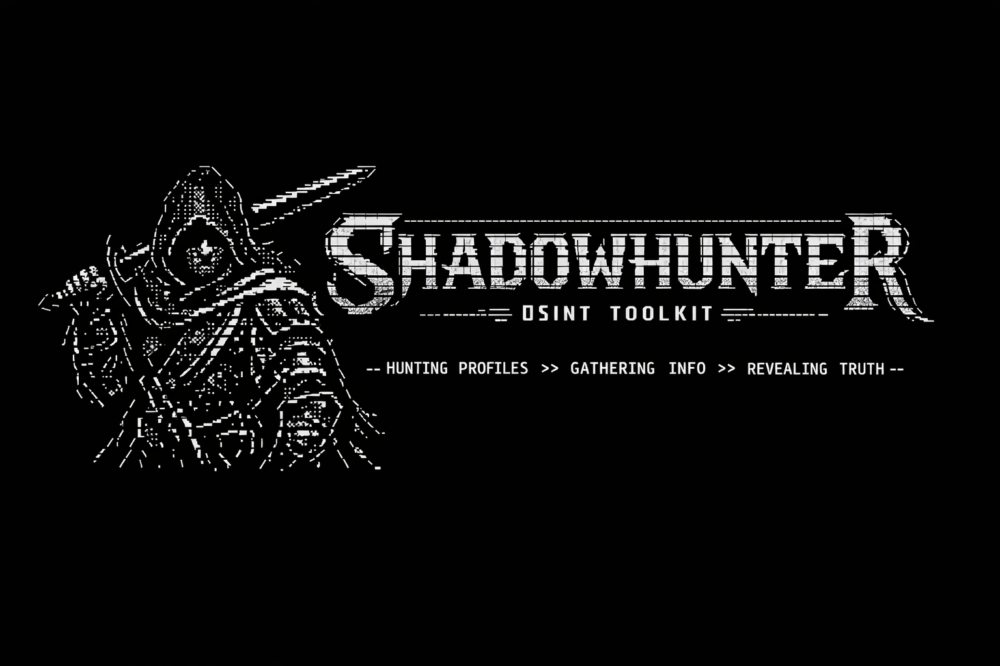

# ShadowHunter
A powerful terminal-based OSINT toolkit for discovering and analyzing publicly available data across usernames, domains, and online platforms

How To Install

pkg update 

pkg upgrade 

pkg install python 

pkg install git 

pip install requests 

git clone https://github.com/MrThivina/ShadowHunter

cd ShadowHunter 

python main.py
